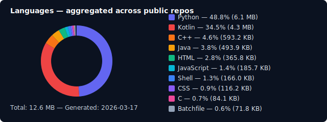

# Bonjour, je suis arn-c0de 👋

**[🇬🇧](README.md) | [🇩🇪](README_DE.md) | [🇨🇳](README_ZH.md) | [🇫🇷](README_FR.md) | [🇮🇹](README_IT.md)**
---
Développeur d'Allemagne 🇩🇪, travaillant principalement sur des applications Android et web, des systèmes embarqués et le développement backend.

**Langues :** Allemand (natif) · Anglais (courant)

---

À propos de moi

Développeur axé sur les systèmes embarqués, la recherche en sécurité et le développement backend

Langages principaux : Kotlin, Python et C, principalement utilisés avec ESP32, radio SDR et outils Wi-Fi

Actuellement en apprentissage de Kotlin, C/C++ pour Windows et Rust pour la programmation bas-niveau

Intéressé par la collaboration, l'apprentissage continu et les échanges techniques

---

## Projets en vedette

### Flight Sim
- 🛩️ [**InteractiveChecklists**](https://github.com/arn-c0de/InteractiveChecklists) - Application compagnon et autonome pour DCS-World

### IoT & Embedded
- 🚪 [**CloseMyThing**](https://github.com/arn-c0de/CloseMyThing) - Capteur ESP32 léger et sécurisé pour détecter l'état ouvert/fermé des portes, fenêtres et contacts similaires

---

## Stack technique

<table>
<tr>
<td width="50%" valign="top">

### Langages

### Frameworks

</td>
<td width="50%" valign="top">

### Embarqué & Matériel

</td>
</tr>
<tr>
<td colspan="2">

### Outils & Plateformes

</td>
</tr>
</table>

---

## Sur quoi je travaille

<table>
<tr>
<td width="33%" valign="top">

### Développement

-  Applications mobiles & web
-  Développement backend
-  Scripts d'automatisation
-  Conception d'API
-  Traitement de données

</td>
<td width="33%" valign="top">

### Sécurité & Réseaux

-  Projets SDR
-  Solutions d'auto-hébergement
-  Recherche en sécurité Wi-Fi
-  Surveillance réseau (IDS/IPS)
-  Tests d'intrusion

</td>
<td width="33%" valign="top">

### Matériel & IoT

-  Systèmes embarqués
-  Projets ESP32 / ESP8266
-  LoRa & LPWAN
-  Conception de PCB & prototypage
-  Domotique
-  Simulation de vol

</td>
</tr>
</table>

---

## Axes d'apprentissage actuels

<table>
<tr>
<td width="50%" valign="top">

### Programmation & Développement

- C/C++ pour le développement Windows
- Kotlin / Java
- Programmation système bas-niveau
- Langage de programmation Rust
- Architecture logicielle sécurisée
- Patterns de conception modernes

</td>
<td width="50%" valign="top">

### Sécurité & Ingénierie

- Pratiques de sécurité défensive
- Fondamentaux du reverse engineering
- Techniques de durcissement de projets
- Recherche de vulnérabilités
- Revue de code sécurisée

</td>
</tr>
</table>

---

## Statistiques GitHub

  

  Automated language tracking system — <a href="docs/LANGUAGE-TRACKING.md">View implementation details</a>

  

---

## Contact

  
  

---

## Contact

<table>
<tr>
<td width="50%" valign="top">

### Problèmes de sécurité & Vulnérabilités

📫 **arn-c0de@protonmail.com**

Pour les préoccupations liées à la sécurité, les rapports de vulnérabilité ou les divulgations de bugs sensibles.

</td>
<td width="50%" valign="top">

### Demandes générales

💬 **GitHub Issues**

Pour les bugs, les demandes de fonctionnalités et les discussions générales sur les projets, veuillez utiliser le suivi des problèmes du dépôt concerné.

</td>
</tr>
</table>

---

  <em>Tous les projets liés à la sécurité sont strictement à des fins éducatives et de recherche.</em>

